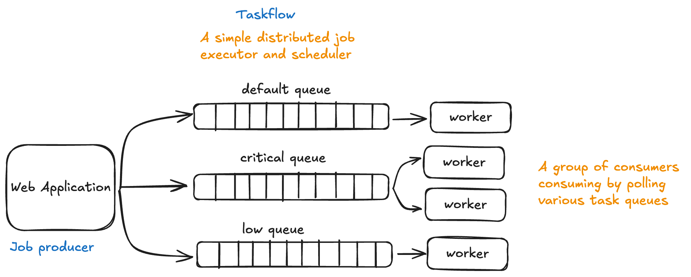

# TaskFlow: Task scheduler in Go




TaskFlow is an efficient task scheduler which is used to schedule jobs and tasks and multiple workers can pick those tasks and execute them

## Usage
```
package tasks

import (
	"context"
	"encoding/json"
	"log"
	"fmt"
	"time"

	taskflowgosdk "github.com/nikhilbhatia08/taskflow/taskflow-gosdk"
)

type EmailPayload struct {
	EmailSenderId string
	EmailRecieverId string
	EmailBody string
}

// Write a function to create a task which consists of queuename, payload and the number of retries
func EmailDelivery() error {
	taskflow, err := taskflowgosdk.NewServer("localhost:9003", "localhost:9002") // The configurations of the jobservice and the queueservice
	if err != nil {
		return err
	}

	payload, err := json.Marshal(EmailPayload{EmailSenderId: "SomeSenderId", EmailRecieverId: "SomeRecieverId", EmailBody: "Some body"})
	if err != nil {
		return err
	}
	taskflow.NewJob(&taskflowgosdk.CreateJobRequest{
		QueueName: "EmailQueue",
		Payload: string(payload),
		Retries: 5,
	})
	return nil
}
```

## System Components

## Life of a schedule

## Directory structure

Here's a brief overview of the project's directory structure:

- [`cmd/`](./cmd/): Contains the main entry points for the scheduler, coordinator, task queue and worker services.
- [`pkg/`](./pkg/): Contains the core logic for the scheduler, coordinator, task queue and worker services.
- [`data/`](./data/): Contains SQL scripts to initialize the db.
- [`tests/`](./tests/): Contains integration tests.
- [`*-dockerfile`](./docker-compose.yml): Dockerfiles for building the scheduler, coordinator, task queue and worker services.
- [`docker-compose.yml`](./docker-compose.yml): Docker Compose configuration file for spinning up the entire cluster.
